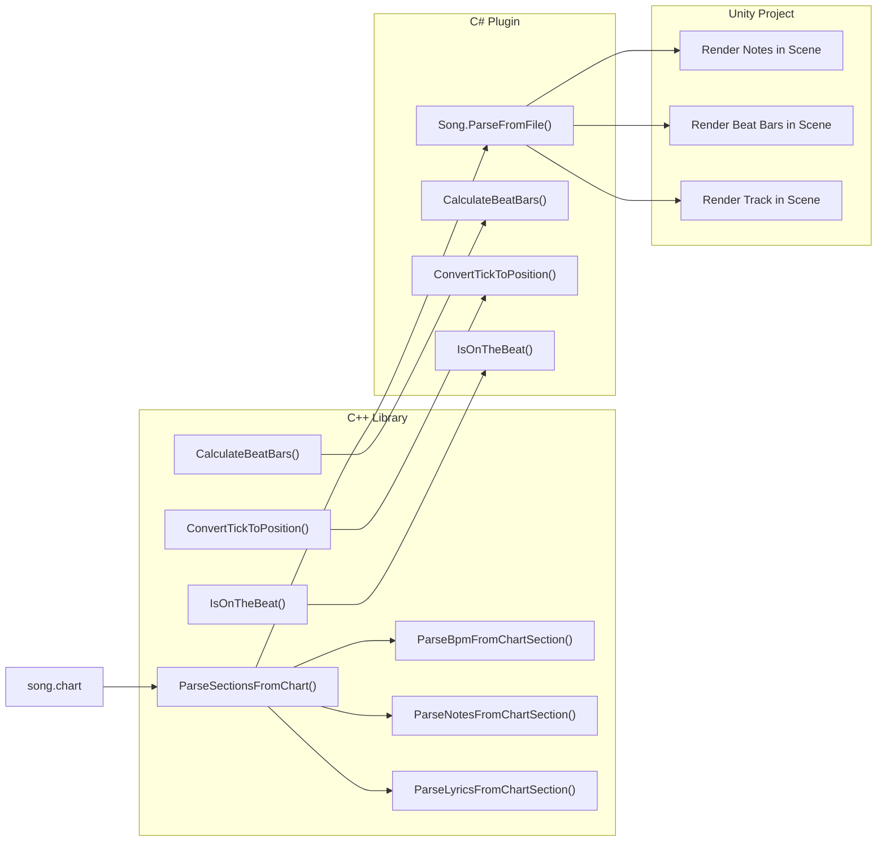
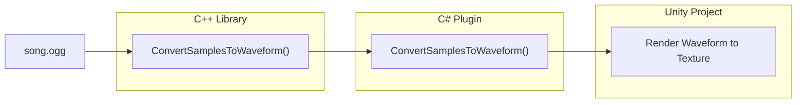

## Architecture

The current architecture for this project (Unity specifically) looks like this:

### Rendering Notes

```mermaid
graph LR;
    file["song.chart"]

    file-->parseSectionsFromChartCpp

    subgraph cppLibrary ["C++ Library"]
        parseSectionsFromChartCpp["ParseSectionsFromChart()"]
        parseBpmFromChartSectionCpp["ParseBpmFromChartSection()"]
        parseNotesFromChartSectionCpp["ParseNotesFromChartSection()"]
        parseLyricsFromChartSectionCpp["ParseLyricsFromChartSection()"]

        calculateBeatBarsCpp["CalculateBeatBars()"]

        convertTickToPositionCpp["ConvertTickToPosition()"]
        isOnTheBeatCpp["IsOnTheBeat()"]

        parseSectionsFromChartCpp
        parseBpmFromChartSectionCpp
        parseNotesFromChartSectionCpp
        parseLyricsFromChartSectionCpp

        calculateBeatBarsCpp

        convertTickToPositionCpp
        isOnTheBeatCpp
    end

    subgraph csharpLibrary ["C# Plugin"]
        songParseFromFileCsharp["Song.ParseFromFile()"]

        calculateBeatBarsCsharp["CalculateBeatBars()"]

        convertTickToPositionCsharp["ConvertTickToPosition()"]
        isOnTheBeatCsharp["IsOnTheBeat()"]

        calculateBeatBarsCsharp

        convertTickToPositionCsharp
        isOnTheBeatCsharp
    end

    subgraph unityProject ["Unity Project"]
        renderNotesInScene["Render Notes in Scene"]
        renderBeatBarsInScene["Render Beat Bars in Scene"]
        renderTrackInScene["Render Track in Scene"]
    end

    parseSectionsFromChartCpp-->parseBpmFromChartSectionCpp
    parseSectionsFromChartCpp-->parseNotesFromChartSectionCpp
    parseSectionsFromChartCpp-->parseLyricsFromChartSectionCpp

    parseSectionsFromChartCpp-->songParseFromFileCsharp

    calculateBeatBarsCpp-->calculateBeatBarsCsharp
    convertTickToPositionCpp-->convertTickToPositionCsharp
    isOnTheBeatCpp-->isOnTheBeatCsharp

    songParseFromFileCsharp-->renderNotesInScene
    songParseFromFileCsharp-->renderBeatBarsInScene
    songParseFromFileCsharp-->renderTrackInScene
```

### Rendering Audio Frequency

```mermaid
graph LR;
    file["song.ogg"]

    file-->convertSamplesToWaveformCpp

    subgraph cppLibrary ["C++ Library"]
        convertSamplesToWaveformCpp["ConvertSamplesToWaveform()"]
    end

    subgraph csharpLibrary ["C# Plugin"]
        convertSamplesToWaveformCsharp["ConvertSamplesToWaveform()"]
    end

    subgraph unityProject ["Unity Project"]
        renderWaveformToTexture["Render Waveform to Texture"]
    end

    convertSamplesToWaveformCpp-->convertSamplesToWaveformCsharp
    convertSamplesToWaveformCsharp-->renderWaveformToTexture
```
