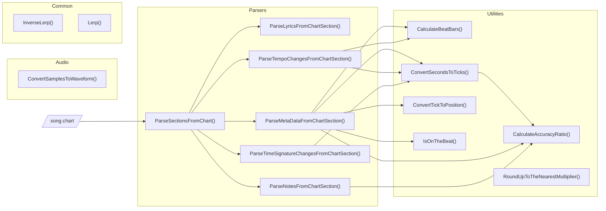

## Architecture

The current architecture for this project looks like this:

### C++ Library / C# Plugin

### Unity Plugin

The Unity plugin includes compiled C++ libraries (macOS, Windows and Linux) and wraps the internal calls in native C# functions. These functions pass and retrieve the data from the C++ library and clean up memory upon completion.

### Unreal Plugin

There isn't a custom wrapper or plugin for Unreal, as the C++ library works as is when included as a header-only library.

### Godot Plugin

Coming soon.

### SDL Library

There isn't a custom wrapper or plugin for SDL, as the C++ library works as is when included as a header-only library.
