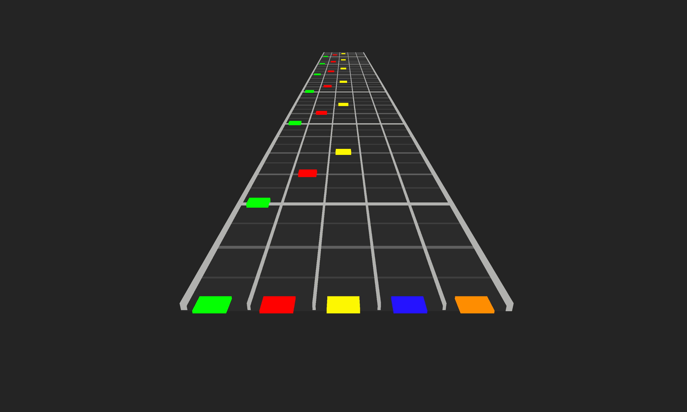
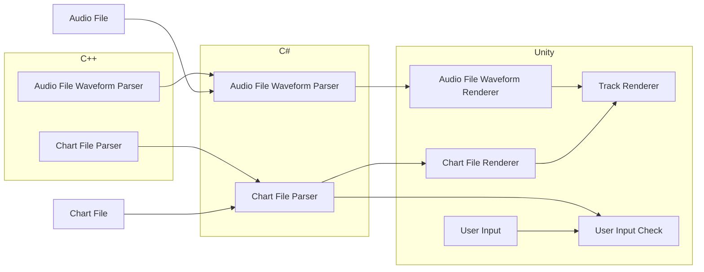

> [!CAUTION]
> This package is in early development and should not be used in production.

# Rhythm Game Utilities


_Prototype game built using these utilities._

## Platforms

This library aims to offer support for multiple platforms through a single codebase. This is highly ambitious, so if you run into an issue with your platform of choice during development, please leave a detailed bug report with as much information as possible. Also, as this library is relatively new, mobile platforms will be fully supported after all other platforms are complete.

| Engine                                                                | Platform | Tested |
| --------------------------------------------------------------------- | -------- | :----: |
| [Unity](https://unity.com/)                                           | macOS    |   ✅   |
| [Unity](https://unity.com/)                                           | Windows  |   ✅   |
| [Unity](https://unity.com/)                                           | WebGL    |   ❌   |
| [Unreal](https://www.unrealengine.com/)                               | macOS    |   -    |
| [Unreal](https://www.unrealengine.com/)                               | Windows  |   -    |
| [Godot 4](https://godotengine.org/)                                   | macOS    |   -    |
| [Godot 4](https://godotengine.org/)                                   | Windows  |   -    |
| [Godot 4](https://godotengine.org/)                                   | WebGL    |   -    |
| [HandcrankEngine](https://github.com/HandcrankEngine/HandcrankEngine) | macOS    |   -    |

## Install

### Unity

Add package via git URL `https://github.com/neogeek/rhythm-game-utilities.git?path=/UnityPackage`.

## Usage

### `Audio`

#### `Audio.ConvertSamplesToWaveform`

```csharp
var samples = new float[_audioSource.clip.samples * _audioSource.clip.channels];

_audioSource.clip.GetData(samples, 0);

var color = Color.red;
var transparentColor = new Color(0, 0, 0, 0);

var waveform = Audio.ConvertSamplesToWaveform(samples, _texture2D.width, _texture2D.height);

for (var x = 0; x < waveform.Length; x += 1)
{
    for (var y = 0; y < waveform[x].Length; y += 1)
    {
        _texture2D.SetPixel(x, y, waveform[x][y] == 1 ? color : transparentColor);
    }
}

_texture2D.Apply();
```

### `Song.FromChartFile`

```csharp
using RhythmGameUtilities;

var contents = File.ReadAllText("notes.chart", Encoding.UTF8);
var song = RhythmGameUtilities.Song.FromChartFile(contents);
```

### `Song.FromJSON`

```csharp
using RhythmGameUtilities;

var json = File.ReadAllText("notes.json", Encoding.UTF8);
var song = RhythmGameUtilities.Song.FromJSON(json);
```

### `Parsers`

Read more about `.chart` files: <https://github.com/TheNathannator/GuitarGame_ChartFormats/blob/main/doc/FileFormats/.chart/Core%20Infrastructure.md>

#### `Parsers.ParseSectionsFromChart`

```csharp
using RhythmGameUtilities;

var sections = Parsers.ParseSectionsFromChart(contents);
```

#### `Parsers.ParseBpmFromChartChartSection`

```csharp
using RhythmGameUtilities;

var sections = Parsers.ParseSectionsFromChart(contents);

var bpm = Parsers.ParseBpmFromChartChartSection(sections[NamedSection.SyncTrack]);
```

#### `Parsers.ParseTrackEventsFromChartSection`

```csharp
using RhythmGameUtilities;

var sections = Parsers.ParseSectionsFromChart(contents);

var trackEvents =
    Parsers.ParseTrackEventsFromChartSection(sections[$"{Difficulty.Expert}Single"], TypeCode.Event);
```

#### `Parsers.ParseNotesFromChartSection`

```csharp
using RhythmGameUtilities;

var sections = Parsers.ParseSectionsFromChart(contents);

var notes = Parsers.ParseNotesFromChartSection(sections[$"{Difficulty.Expert}Single"]);
```

#### `Parsers.ParseLyricsFromChartSection`

```csharp
using RhythmGameUtilities;

var sections = Parsers.ParseSectionsFromChart(contents);

var lyrics = Parsers.ParseLyricsFromChartSection(sections[NamedSection.Events]);
```

### Utilities

#### `Utilities.ConvertTicksToSeconds`

```csharp
const int tick = 2784;
const int resolution = 192;
const int bpm = 124;

var seconds = Utilities.ConvertTicksToSeconds(tick, resolution, bpm);
```

#### `Utilities.ConvertSecondsToTicks`

```csharp
const float seconds = 7.01f;
const int resolution = 192;
const int bpm = 124;

var ticks = Utilities.ConvertSecondsToTicks(seconds, resolution, bpm);
```

#### `Utilities.CalculateNoteHitAccuracy`

```csharp
var note = new Note { Position = 2884 };

const int buffer = 60;

var accuracy = Utilities.CalculateNoteHitAccuracy(ref note, buffer, currentTick);

var score = Mathf.CeilToInt(Mathf.Lerp(0, 100, accuracy));
```

#### `Utilities.CalculateScale`

```csharp
const int baseBpm = 160;
const float speed = 5;

var scale = Utilities.CalculateScale(baseBpm, 120, speed);
```

#### `Utilities.Lerp`

```csharp
var position = Utilities.Lerp(0, 10, 0.5f);
```

#### `Utilities.InverseLerp`

```csharp
var percentage = Utilities.InverseLerp(0, 10, 5);
```

## Build

### macOS / Linux

> [!IMPORTANT]
> When developing for macOS, make sure that **Mac** is selected in the bottom right-hand corner of Visual Studio Code or C++ Intellisense will not work.

```bash
./bin/build.sh
```

### Windows

> [!IMPORTANT]
> When developing for Windows, make sure that **Win32** is selected in the bottom right-hand corner of Visual Studio Code or C++ Intellisense will not work.

Run from **x64 Native Tools Command Prompt for VS**:

```cmd
call "./bin/build.bat"
```

## Test

Add tests to your project by adding the following to your `Packages/manifest.json` file:

```json
{
...
    "testables": ["com.scottdoxey.rhythm-game-utilities"]
...
}
```

## Architecture


