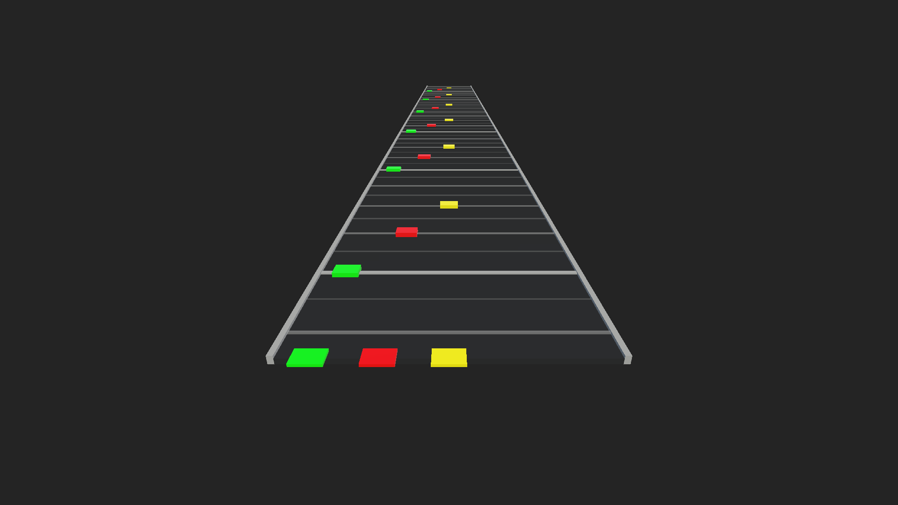

> [!CAUTION]
> This package is in early development and should not be used in production.

# Rhythm Game Utilities

[](https://github.com/neogeek/rhythm-game-utilities/actions/workflows/test.workflow.yml)
[](https://github.com/neogeek/rhythm-game-utilities/actions/workflows/build.workflow.yml)
[](https://discord.gg/nNtFsfd)

This library is a collection of utilities for creating rhythm games like Tap Tap Revenge, Guitar Hero, and Rock Band. It is meant to be used within any game engine that supports loading C++ libraries, such as Unity, Unreal, and Godot.


_Prototype game built using these utilities._

## Social

- Star [this repo on GitHub](https://github.com/neogeek/rhythm-game-utilities) for updates
- Follow me on [Bluesky](https://bsky.app/profile/scottdoxey.com) or [Twitter](https://twitter.com/neogeek)
- Join the [Discord](https://discord.gg/nNtFsfd)
- Follow me on [GitHub](https://github.com/neogeek/)

## Table of Contents

- [Install](#install)
- [Platforms](#platforms)
- [Usage](#usage)
- [Architecture](#architecture)
- [Git Hooks](#git-hooks)
- [Testing](#testing)
- [Build](#build)
- [Contributing](#contributing)
- [Community Roadmap](#community-roadmap)
- [License](#license)

## Install

### Unity

Add package via git URL `https://github.com/neogeek/rhythm-game-utilities.git?path=/UnityPackage`.

### Unreal

Coming soon.

### Godot

Coming soon.

### HandcrankEngine

Coming soon.

## Platforms

This library aims to offer support for multiple platforms through a single codebase. This is highly ambitious, so if you run into an issue with your platform of choice during development, please leave a detailed bug report with as much information as possible. Also, as this library is relatively new, mobile platforms will be fully supported after all other platforms are complete.

| Engine                                                                | Platform | Tested |
| --------------------------------------------------------------------- | -------- | :----: |
| [Unity](https://unity.com/)                                           | macOS    |   ✅   |
| [Unity](https://unity.com/)                                           | Windows  |   ✅   |
| [Unity](https://unity.com/)                                           | WebGL    |   ❌   |
| [Unreal](https://www.unrealengine.com/)                               | macOS    |   -    |
| [Unreal](https://www.unrealengine.com/)                               | Windows  |   -    |
| [Godot 4](https://godotengine.org/)                                   | macOS    |   -    |
| [Godot 4](https://godotengine.org/)                                   | Windows  |   -    |
| [Godot 4](https://godotengine.org/)                                   | WebGL    |   -    |
| [HandcrankEngine](https://github.com/HandcrankEngine/HandcrankEngine) | macOS    |   ⏳   |
| [HandcrankEngine](https://github.com/HandcrankEngine/HandcrankEngine) | Windows  |   ⏳   |

## Usage

### `Audio`

#### `Audio.ConvertSamplesToWaveform`

```csharp
using RhythmGameUtilities;

var samples = new float[_audioSource.clip.samples * _audioSource.clip.channels];

_audioSource.clip.GetData(samples, 0);

var color = Color.red;
var transparentColor = new Color(0, 0, 0, 0);

var waveform = Audio.ConvertSamplesToWaveform(samples, _texture2D.width, _texture2D.height);

for (var x = 0; x < waveform.Length; x += 1)
{
    for (var y = 0; y < waveform[x].Length; y += 1)
    {
        _texture2D.SetPixel(x, y, waveform[x][y] == 1 ? color : transparentColor);
    }
}

_texture2D.Apply();
```

### `Song`

#### `Song.FromChartFile`

```csharp
using RhythmGameUtilities;

var contents = File.ReadAllText("notes.chart", Encoding.UTF8);
var song = RhythmGameUtilities.Song.FromChartFile(contents);
```

#### `Song.FromJSON`

```csharp
using RhythmGameUtilities;

var json = File.ReadAllText("notes.json", Encoding.UTF8);
var song = RhythmGameUtilities.Song.FromJSON(json);
```

### `Parsers`

Read more about `.chart` files: <https://github.com/TheNathannator/GuitarGame_ChartFormats/blob/main/doc/FileFormats/.chart/Core%20Infrastructure.md>

#### `Parsers.ParseSectionsFromChart`

```csharp
using RhythmGameUtilities;

var sections = Parsers.ParseSectionsFromChart(contents);
```

#### `Parsers.ParseTimeSignaturesFromChartSection`

```csharp
using RhythmGameUtilities;

var sections = Parsers.ParseSectionsFromChart(contents);

var timeSignatures = Parsers.ParseTimeSignaturesFromChartSection(sections[NamedSection.SyncTrack]);
```

#### `Parsers.ParseBpmFromChartSection`

```csharp
using RhythmGameUtilities;

var sections = Parsers.ParseSectionsFromChart(contents);

var bpm = Parsers.ParseBpmFromChartSection(sections[NamedSection.SyncTrack]);
```

#### `Parsers.ParseNotesFromChartSection`

```csharp
using RhythmGameUtilities;

var sections = Parsers.ParseSectionsFromChart(contents);

var notes = Parsers.ParseNotesFromChartSection(sections[$"{Difficulty.Expert}Single"]);
```

#### `Parsers.ParseLyricsFromChartSection`

```csharp
using RhythmGameUtilities;

var sections = Parsers.ParseSectionsFromChart(contents);

var lyrics = Parsers.ParseLyricsFromChartSection(sections[NamedSection.Events]);
```

### Utilities

#### `Utilities.ConvertTickToPosition`

```csharp
using RhythmGameUtilities;

const int tick = 2784;
const int resolution = 192;

var position = Utilities.ConvertTickToPosition(tick, resolution);
```

#### `Utilities.ConvertSecondsToTicks`

```csharp
using RhythmGameUtilities;

const int seconds = 2784;
const int resolution = 192;
const bpmChanges = new Dictionary<int, int>();

var ticks = Utilities.ConvertSecondsToTicks(seconds, resolution, bpmChanges);
```

#### `Utilities.IsOnTheBeat`

```csharp
using RhythmGameUtilities;

const int bpm = 120;
const int currentTime = 10;

if (Utilities.IsOnTheBeat(bpm, currentTime))
{

}
```

#### `Utilities.RoundUpToTheNearestMultiplier`

```csharp
using RhythmGameUtilities;

var value = Utilities.RoundUpToTheNearestMultiplier(12, 10);
```

### Common

#### `Common.Lerp`

```csharp
using RhythmGameUtilities;

var value = Common.Lerp(0, 10, 0.5f);
```

#### `Utilities.InverseLerp`

```csharp
using RhythmGameUtilities;

var value = Common.InverseLerp(0, 10, 5);
```

## Architecture


## Git Hooks

The git hooks that run are quick file checks to ensure the files in the dotnet project and the UnityProject are the same and that the build files haven't changed.

```bash
$ git config --local core.hooksPath .githooks/
```

## Testing

Run all tests via `make test`.

- Tests for the C++ library are authored using the C++ native library `cassert`.
- Tests are run automatically via GitHub Actions on each new PR.
- For you add a new feature or fix a bug, please include the benchmark output in the PR along with your device stats.

If you want to test the projecet from within Unity, add the test namespace to your project by adding the following to your `Packages/manifest.json` file:

```json
{
...
    "testables": ["com.scottdoxey.rhythm-game-utilities"]
...
}
```

## Build

> [!WARNING]
> Do not commit any build changes to the repo. The build files are automatically generated via GitHub Actions.

### macOS

When developing on macOS, make sure that **Mac** is selected in the bottom right-hand corner of Visual Studio Code or C++ Intellisense will not work.

```bash
./bin/build.sh
```

### Windows

When developing on Windows, make sure that **Win32** is selected in the bottom right-hand corner of Visual Studio Code or C++ Intellisense will not work.

Run from **x64 Native Tools Command Prompt for VS**:

```cmd
call "./bin/build.bat"
```

## Contributing

Be sure to review the [Contributing Guidelines](./CONTRIBUTING.md) before logging an issue or making a pull request.

## Community Roadmap

This project aims to help you build your rhythm game as fast as possible without needing to learn the complexities of a new library. Instead, you can utilize comprehensive examples and simple code recipes If you have feature requests or bugs, please create an issue and tag them with the appropriate tag. If an issue already exists, vote for it with 👍.

- [Feature Requests](https://github.com/neogeek/rhythm-game-utilities/labels/enhancement)
- [Bugs](https://github.com/neogeek/rhythm-game-utilities/labels/bug)

## License

[The MIT License (MIT)](./LICENSE)
