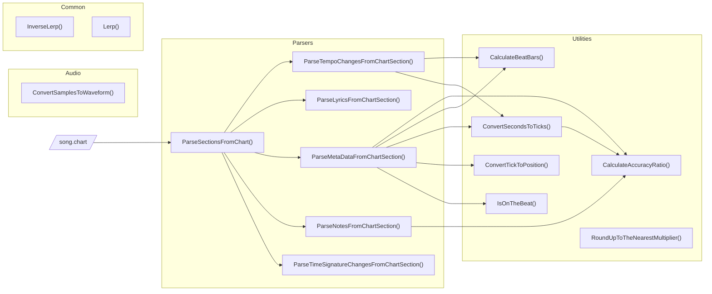

> [!CAUTION]
> This package is in early development and should not be used in production.


[](https://github.com/neogeek/rhythm-game-utilities/actions/workflows/test.workflow.yml)
[](https://github.com/neogeek/rhythm-game-utilities/actions/workflows/build.workflow.yml)
[](https://www.nuget.org/packages/com.neogeek.rhythm-game-utilities/)
[](https://discord.gg/nNtFsfd)

This library is a collection of utilities for creating rhythm games like Tap Tap Revenge, Guitar Hero, and Rock Band. It is meant to be used within any game engine that supports loading C++ libraries, such as Unity, Unreal, Godot and SDL.


_Prototype game built using these utilities._

## Features

- 🎵 Parse `.chart` and `.midi` song files
- 🎼 Calculate position to render notes
- 💯 Calculate hit accuracy
- 🥁 Determine if the current time is on the beat
- 💫 And more!

## Social

- Star [this repo on GitHub](https://github.com/neogeek/rhythm-game-utilities) for updates
- Follow me on [Bluesky](https://bsky.app/profile/scottdoxey.com) or [Twitter](https://twitter.com/neogeek)
- Join the [Discord](https://discord.gg/nNtFsfd)
- Follow me on [GitHub](https://github.com/neogeek/)

## Table of Contents

- [Platforms](#platforms)
- [Install](#install)
- [API](#api)

  1. [Audio](#audio)
     1. [ConvertSamplesToWaveform](#audioconvertsamplestowaveform)
  1. [Common](#common)
     1. [InverseLerp](#commoninverselerp)
     1. [Lerp](#commonlerp)
  1. [Parsers](#parsers)
     1. [ParseTempoChangesFromChartSection](#parsersparsetempochangesfromchartsection)
     1. [ParseLyricsFromChartSection](#parsersparselyricsfromchartsection)
     1. [ParseMetaDataFromChartSection](#parsersparsemetadatafromchartsection)
     1. [ParseNotesFromChartSection](#parsersparsenotesfromchartsection)
     1. [ParseSectionsFromChart](#parsersparsesectionsfromchart)
     1. [ParseTimeSignatureChangesFromChartSection](#parsersparsetimesignaturechangesfromchartsection)
  1. [Utilities](#utilities)
     1. [CalculateAccuracyRatio](#utilitiescalculateaccuracyratio)
     1. [CalculateBeatBars](#utilitiescalculatebeatbars)
     1. [ConvertSecondsToTicks](#utilitiesconvertsecondstoticks)
     1. [ConvertTickToPosition](#utilitiesconvertticktoposition)
     1. [FindPositionNearGivenTick](#utilitiesfindpositionneargiventick)
     1. [IsOnTheBeat](#utilitiesisonthebeat)
     1. [RoundUpToTheNearestMultiplier](#utilitiesrounduptothenearestmultiplier)

- [Architecture](#architecture)
- [Git Hooks](#git-hooks)
- [Testing](#testing)
- [Build](#build)
- [Contributing](#contributing)
- [Community Roadmap](#community-roadmap)
- [Other Projects](#other-projects)
- [License](#license)

## Platforms

This library aims to offer support for multiple platforms through a single codebase. This is highly ambitious, so if you run into an issue with your platform of choice during development, please leave a detailed bug report with as much information as possible. Also, as this library is relatively new, mobile platforms will be fully supported after all other platforms are complete.

| Engine                                  | Language | Platform |                  Version                  | Tested | Stable |
| --------------------------------------- | -------- | -------- | :---------------------------------------: | :----: | :----: |
| [Unity](https://unity.com/)             | C#       | macOS    | 6000.0.22f1<br>2022.3.50f1<br>2021.3.44f1 |   ✅   |   ❌   |
| [Unity](https://unity.com/)             | C#       | Windows  | 6000.0.22f1<br>2022.3.50f1<br>2021.3.44f1 |   ✅   |   ❌   |
| [Unreal](https://www.unrealengine.com/) | C++      | macOS    |                   5.4.4                   |   ✅   |   ❌   |
| [Unreal](https://www.unrealengine.com/) | C++      | Windows  |                   5.4.4                   |   ✅   |   ❌   |
| [Godot 4](https://godotengine.org/)     | GDScript | macOS    |                    4.3                    |   ✅   |   ❌   |
| [Godot 4](https://godotengine.org/)     | GDScript | Windows  |                    4.3                    |   ✅   |   ❌   |
| [Godot 4](https://godotengine.org/)     | C#       | macOS    |                    4.3                    |   ✅   |   ❌   |
| [Godot 4](https://godotengine.org/)     | C#       | Windows  |                    4.3                    |   ✅   |   ❌   |
| [SDL](https://www.libsdl.org/)          | C++      | macOS    |                  2.30.8                   |   ✅   |   ❌   |
| [SDL](https://www.libsdl.org/)          | C++      | Windows  |                  2.30.8                   |   -    |   -    |
| [MonoGame](https://monogame.net/)       | C#       | macOS    |                   3.8.2                   |   ✅   |   ❌   |
| [MonoGame](https://monogame.net/)       | C#       | Windows  |                   3.8.2                   |   ✅   |   ❌   |

## Install

### Unity

1. Add package via git URL
   ```
   https://github.com/neogeek/rhythm-game-utilities.git?path=/UnityPackage
   ```
1. Import the sample project (optional)
   - Check the materials to make sure they work in the version of Unity and render pipeline you selected.

### Unreal

1. Clone this repo locally (using either a tagged release or the main development branch).
1. Add the include path to your `<project>.Build.cs` file.
   ```csharp
   PublicIncludePaths.AddRange(new string[] { "D:/git/github/rhythm-game-utilities/include" });
   ```

### Godot

#### GDScript

Download and install the latest release (coming soon).

#### C#

Install the nuget package [com.neogeek.rhythm-game-utilities](https://www.nuget.org/packages/com.neogeek.rhythm-game-utilities/) via the CLI or from within your IDE.

```bash
dotnet add package com.neogeek.rhythm-game-utilities --version 1.0.0-alpha.3
```

### SDL

1. Clone this repo locally (using either a tagged release or the main development branch).
1. Add the include path to your project.
   - VS Code: `.vscode/c_cpp_properties.json`
     ```json
     "includePath": [
         "${workspaceFolder}/**",
         "${HOME}/git/github/rhythm-game-utilities/include/**"
     ]
     ```
1. Add the include path to your build command.
   - `g++`
     ```bash
     g++ -std=c++17 -o build/output src/*.cpp -Isrc \
         -I"${HOME}/git/github/rhythm-game-utilities/include/" \
         -I/opt/homebrew/Cellar/sdl2/2.30.8/include/SDL2 -L/opt/homebrew/Cellar/sdl2/2.30.8/lib \
         -lSDL2
     ```
1. Add the include path to your CMAKE `CMakeLists.txt` file.
   ```cmake
   include_directories($ENV{HOME}/git/github/rhythm-game-utilities/include/)
   ```

### MonoGame

Install the nuget package [com.neogeek.rhythm-game-utilities](https://www.nuget.org/packages/com.neogeek.rhythm-game-utilities/) via the CLI or from within your IDE.

```bash
dotnet add package com.neogeek.rhythm-game-utilities --version 1.0.0-alpha.3
```

## API

### `Audio`

#### `Audio.ConvertSamplesToWaveform`

> Languages: `C#`

```csharp
using RhythmGameUtilities;

var samples = new float[_audioSource.clip.samples * _audioSource.clip.channels];

_audioSource.clip.GetData(samples, 0);

var color = Color.red;
var transparentColor = new Color(0, 0, 0, 0);

var waveform = Audio.ConvertSamplesToWaveform(samples, _texture2D.width, _texture2D.height);

for (var x = 0; x < waveform.Length; x += 1)
{
    for (var y = 0; y < waveform[x].Length; y += 1)
    {
        _texture2D.SetPixel(x, y, waveform[x][y] == 1 ? color : transparentColor);
    }
}

_texture2D.Apply();
```

### Common

#### `Common.InverseLerp`

> Languages: `C#` `C++` `GDScript`

##### C#

```csharp
using System;
using RhythmGameUtilities;

var value = Common.InverseLerp(0, 10, 5);

Console.WriteLine(value); // 0.5
```

##### C++

```cpp
#include <iostream>

#include "RhythmGameUtilities/Common.hpp"

using namespace RhythmGameUtilities;

int main()
{
    auto value = InverseLerp(0, 10, 5);

    std::cout << value << std::endl; // 0.5

    return 0;
}
```

##### GDScript

```gdscript
extends Node

func _ready() -> void:
	var value = rhythm_game_utilities.inverse_lerp(0, 10, 5)

	print(value) # 0.5
```

#### `Common.Lerp`

> Languages: `C#` `C++` `GDScript`

##### C#

```csharp
using System;
using RhythmGameUtilities;

var value = Common.Lerp(0, 10, 0.5f);

Console.WriteLine(value); // 5
```

##### C++

```cpp
#include <iostream>

#include "RhythmGameUtilities/Common.hpp"

using namespace RhythmGameUtilities;

int main()
{
    auto value = Lerp(0, 10, 0.5f);

    std::cout << value << std::endl; // 5

    return 0;
}
```

##### GDScript

```gdscript
extends Node

func _ready() -> void:
	var value = rhythm_game_utilities.lerp(0, 10, 0.5)

	print(value) # 5
```

### `Parsers`

Read more about `.chart` files: <https://github.com/TheNathannator/GuitarGame_ChartFormats/blob/main/doc/FileFormats/.chart/Core%20Infrastructure.md>

#### `Parsers.ParseLyricsFromChartSection`

> Languages: `C#` `C++` `GDScript`

##### C#

```csharp
using System;
using RhythmGameUtilities;

var sections = Parsers.ParseSectionsFromChart(contents);

var lyrics = Parsers.ParseLyricsFromChartSection(sections[NamedSection.Events]);

Console.WriteLine(lyrics.Count); // 12
```

##### C++

```cpp
#include <iostream>

#include "RhythmGameUtilities/File.hpp"
#include "RhythmGameUtilities/Parsers.hpp"

using namespace RhythmGameUtilities;

int main()
{
    auto content = ReadStringFromFile("./song.chart");

    auto sections = ParseSectionsFromChart(content.c_str());

    auto lyrics = ParseLyricsFromChartSection(
        sections.at(ToString(NamedSection::Events)));

    std::cout << size(lyrics) << std::endl; // 12

    return 0;
}
```

##### GDScript

```gdscript
extends Node

func _ready() -> void:
	var file = FileAccess.open("res://song.chart", FileAccess.READ)
	var content = file.get_as_text()

	var sections = rhythm_game_utilities.parse_sections_from_chart(content)

	var lyrics = rhythm_game_utilities.parse_lyrics_from_chart_section(sections["Events"])

	print(lyrics)
```

#### `Parsers.ParseMetaDataFromChartSection`

> Languages: `C#` `C++` `GDScript`

##### C#

```csharp
using System;
using RhythmGameUtilities;

var sections = Parsers.ParseSectionsFromChart(contents);

var metaData = Parsers.ParseMetaDataFromChartSection(sections[NamedSection.Song]);

Console.WriteLine(metaData["Name"]); // Example Song
Console.WriteLine(metaData["Resolution"]); // 192
Console.WriteLine(metaData["MusicStream"]); // Example Song.ogg
```

##### C++

```cpp
#include <iostream>

#include "RhythmGameUtilities/File.hpp"
#include "RhythmGameUtilities/Parsers.hpp"

using namespace RhythmGameUtilities;

int main()
{
    auto content = ReadStringFromFile("./song.chart");

    auto sections = ParseSectionsFromChart(content.c_str());

    auto metaData = ParseMetaDataFromChartSection(
        sections.at(ToString(NamedSection::Song)));

    std::cout << metaData["Name"] << std::endl; // Example Song
    std::cout << metaData["Resolution"] << std::endl; // 192
    std::cout << metaData["MusicStream"] << std::endl; // Example Song.ogg

    return 0;
}
```

##### GDScript

```gdscript
extends Node

func _ready() -> void:
	var file = FileAccess.open("res://song.chart", FileAccess.READ)
	var content = file.get_as_text()

	var sections = rhythm_game_utilities.parse_sections_from_chart(content)

	var meta_data = rhythm_game_utilities.parse_meta_data_from_chart_section(sections["Song"])

	print(meta_data)
```

#### `Parsers.ParseNotesFromChartSection`

> Languages: `C#` `C++` `GDScript`

##### C#

```csharp
using System;
using RhythmGameUtilities;

var sections = Parsers.ParseSectionsFromChart(contents);

var notes = Parsers.ParseNotesFromChartSection(sections[$"{Difficulty.Expert}Single"]);

Console.WriteLine(notes.Length); // 8
```

##### C++

```cpp
#include <iostream>

#include "RhythmGameUtilities/File.hpp"
#include "RhythmGameUtilities/Parsers.hpp"

using namespace RhythmGameUtilities;

int main()
{
    auto content = ReadStringFromFile("./song.chart");

    auto sections = ParseSectionsFromChart(content.c_str());

    auto notes = ParseNotesFromChartSection(
        sections.at(ToString(Difficulty::Expert) + "Single"));

    for (auto &note : notes)
    {
        if (note.HandPosition > 5)
        {
            continue;
        }

        std::cout << note.Position << " " << note.HandPosition << std::endl;
    }

    return 0;
}
```

##### GDScript

```gdscript
extends Node

func _ready() -> void:
	var file = FileAccess.open("res://song.chart", FileAccess.READ)
	var content = file.get_as_text()

	var sections = rhythm_game_utilities.parse_sections_from_chart(content)

	var notes = rhythm_game_utilities.parse_notes_from_chart_section(sections["ExpertSingle"])

	print(notes)
```

#### `Parsers.ParseSectionsFromChart`

> Languages: `C#` `C++` `GDScript`

##### C#

```csharp
using System;
using RhythmGameUtilities;

var sections = Parsers.ParseSectionsFromChart(contents);

Console.WriteLine(sections.Count); // 4
```

##### C++

```cpp
#include <iostream>

#include "RhythmGameUtilities/File.hpp"
#include "RhythmGameUtilities/Parsers.hpp"

using namespace RhythmGameUtilities;

int main()
{
    auto content = ReadStringFromFile("./song.chart");

    auto sections = ParseSectionsFromChart(content.c_str());

    std::cout << size(sections) << std::endl; // 4

    return 0;
}
```

##### GDScript

```gdscript
extends Node

func _ready() -> void:
	var file = FileAccess.open("res://song.chart", FileAccess.READ)
	var content = file.get_as_text()

	var sections = rhythm_game_utilities.parse_sections_from_chart(content)

	print(sections)
```

#### `Parsers.ParseTempoChangesFromChartSection`

> Languages: `C#` `C++` `GDScript`

##### C#

```csharp
using System;
using RhythmGameUtilities;

var sections = Parsers.ParseSectionsFromChart(contents);

var tempoChanges = Parsers.ParseTempoChangesFromChartSection(sections[NamedSection.SyncTrack]);

Console.WriteLine(tempoChanges.Length); // 7
```

##### C++

```cpp
#include <iostream>

#include "RhythmGameUtilities/File.hpp"
#include "RhythmGameUtilities/Parsers.hpp"

using namespace RhythmGameUtilities;

int main()
{
    auto content = ReadStringFromFile("./song.chart");

    auto sections = ParseSectionsFromChart(content.c_str());

    auto tempoChanges = ParseTempoChangesFromChartSection(
        sections.at(ToString(NamedSection::SyncTrack)));

    std::cout << size(tempoChanges) << std::endl; // 7

    return 0;
}
```

##### GDScript

```gdscript
extends Node

func _ready() -> void:
	var file = FileAccess.open("res://song.chart", FileAccess.READ)
	var content = file.get_as_text()

	var sections = rhythm_game_utilities.parse_sections_from_chart(content)

	var tempo_changes = rhythm_game_utilities.parse_tempo_changes_from_chart_section(sections["SyncTrack"])

	print(tempo_changes)
```

#### `Parsers.ParseTimeSignatureChangesFromChartSection`

> Languages: `C#` `C++` `GDScript`

##### C#

```csharp
using System;
using RhythmGameUtilities;

var sections = Parsers.ParseSectionsFromChart(contents);

var timeSignatureChanges = Parsers.ParseTimeSignatureChangesFromChartSection(sections[NamedSection.SyncTrack]);

Console.WriteLine(timeSignatureChanges.Length); // 4
```

##### C++

```cpp
#include <iostream>

#include "RhythmGameUtilities/File.hpp"
#include "RhythmGameUtilities/Parsers.hpp"

using namespace RhythmGameUtilities;

int main()
{
    auto content = ReadStringFromFile("./song.chart");

    auto sections = ParseSectionsFromChart(content.c_str());

    auto timeSignatureChanges = ParseTimeSignatureChangesFromChartSection(
        sections.at(ToString(NamedSection::SyncTrack)));

    std::cout << size(timeSignatureChanges) << std::endl; // 4

    return 0;
}
```

##### GDScript

```gdscript
extends Node

func _ready() -> void:
	var file = FileAccess.open("res://song.chart", FileAccess.READ)
	var content = file.get_as_text()

	var sections = rhythm_game_utilities.parse_sections_from_chart(content)

	var time_signature_changes = rhythm_game_utilities.parse_time_signature_changes_from_chart_section(sections["SyncTrack"])

	print(time_signature_changes)
```

### Utilities

#### `Utilities.CalculateAccuracyRatio`

> Languages: `C#` `C++` `GDScript`

##### C#

```csharp
using System;
using RhythmGameUtilities;

const int seconds = 2;
const int resolution = 192;
const int positionDelta = 50;

var tempoChanges = new Tempo[] { new() { Position = 0, BPM = 120000 } };

var timeSignatureChanges = new TimeSignature[] { new() { Position = 0, Numerator = 4, Denominator = 2 } };

var note = new Note { Position = 750 };

var currentPosition =
    Utilities.ConvertSecondsToTicks(seconds, resolution, tempoChanges, timeSignatureChanges);

var value = Utilities.CalculateAccuracyRatio(note.Position, currentPosition, positionDelta);

Console.WriteLine(value); // 0.64
```

##### C++

```cpp
#include <iostream>

#include "RhythmGameUtilities/Utilities.hpp"

using namespace RhythmGameUtilities;

int main()
{
    const int seconds = 2;
    const int resolution = 192;
    const int positionDelta = 50;

    std::vector<Tempo> tempoChanges = {{0, 120000}};
    std::vector<TimeSignature> timeSignatureChanges = {{0, 4}};

    auto note = new Note{750};
    auto currentPosition = ConvertSecondsToTicks(
        seconds, resolution, tempoChanges, timeSignatureChanges);

    auto value =
        CalculateAccuracyRatio(note->Position, currentPosition, positionDelta);

    std::cout << value << std::endl; // 0.64

    return 0;
}
```

##### GDScript

```gdscript
extends Node

func _ready() -> void:
	var seconds = 2
	var resolution = 192
	var position_delta = 50

	var tempo_changes = [
		{"position": 0, "bpm": 120000 }
	]

	var time_signature_changes = [
		{"position": 0, "numerator": 4, "denominator": 2 }
	]

	var current_position = rhythm_game_utilities.convert_seconds_to_ticks(seconds, resolution, tempo_changes, time_signature_changes)

	var value = rhythm_game_utilities.calculate_accuracy_ratio(750, current_position, position_delta)

	print(round(value * 100) / 100.0) # 0.64
```

#### `Utilities.CalculateBeatBars`

> Languages: `C#` `C++` `GDScript`

##### C#

```csharp
var tempoChanges = new Tempo[]
{
    new() { Position = 0, BPM = 88000 }, new() { Position = 3840, BPM = 112000 },
    new() { Position = 9984, BPM = 89600 }, new() { Position = 22272, BPM = 112000 },
    new() { Position = 33792, BPM = 111500 }, new() { Position = 34560, BPM = 112000 },
    new() { Position = 42240, BPM = 111980 }
};

var beatBars = Utilities.CalculateBeatBars(tempoChanges);

Console.WriteLine(beatBars.Length); // 440
```

##### C++

```cpp
#include <iostream>

#include "RhythmGameUtilities/Utilities.hpp"

using namespace RhythmGameUtilities;

int main()
{
    const int resolution = 192;
    const int timeSignature = 4;

    std::vector<Tempo> tempoChanges = {
        {0, 88000},      {3840, 112000},  {9984, 89600},  {22272, 112000},
        {33792, 111500}, {34560, 112000}, {42240, 111980}};

    auto beatBars =
        CalculateBeatBars(tempoChanges, resolution, timeSignature, true);

    std::cout << size(beatBars) << std::endl; // 440

    return 0;
}
```

##### GDScript

```gdscript
extends Node

func _ready() -> void:
	var resolution = 192
	var time_signature = 4

	var tempo_changes = [
		{"position": 0, "bpm": 8800 },
		{"position": 3840, "bpm": 112000 },
		{"position": 9984, "bpm": 89600 },
		{"position": 22272, "bpm": 112000 },
		{"position": 33792, "bpm": 111500 },
		{"position": 34560, "bpm": 112000 },
		{"position": 42240, "bpm": 111980 }
	]

	var beat_bars = rhythm_game_utilities.calculate_beat_bars(tempo_changes, resolution, time_signature, true)

	print(beat_bars)
```

#### `Utilities.ConvertSecondsToTicks`

> Languages: `C#` `C++` `GDScript`

##### C#

```csharp
using System;
using RhythmGameUtilities;

const int seconds = 5;
const int resolution = 192;

var tempoChanges = new Tempo[]
{
    new() { Position = 0, BPM = 88000 }, new() { Position = 3840, BPM = 112000 },
    new() { Position = 9984, BPM = 89600 }, new() { Position = 22272, BPM = 112000 },
    new() { Position = 33792, BPM = 111500 }, new() { Position = 34560, BPM = 112000 },
    new() { Position = 42240, BPM = 111980 }
};

var timeSignatureChanges = new TimeSignature[] { new() { Position = 0, Numerator = 4, Denominator = 2 } };

var ticks = Utilities.ConvertSecondsToTicks(seconds, resolution, tempoChanges, timeSignatureChanges);

Console.WriteLine(ticks); // 1408
```

##### C++

```cpp
#include <iostream>

#include "RhythmGameUtilities/Utilities.hpp"

using namespace RhythmGameUtilities;

int main()
{
    const int seconds = 5;
    const int resolution = 192;

    std::vector<Tempo> tempoChanges = {
        {0, 88000},      {3840, 112000},  {9984, 89600},  {22272, 112000},
        {33792, 111500}, {34560, 112000}, {42240, 111980}};

    std::vector<TimeSignature> timeSignatureChanges = {{0, 4, 2}};

    auto ticks = ConvertSecondsToTicks(seconds, resolution, tempoChanges,
                                       timeSignatureChanges);

    std::cout << ticks << std::endl; // 1408

    return 0;
}
```

##### GDScript

```gdscript
extends Node

func _ready() -> void:
	var seconds = 5
	var resolution = 192

	var tempo_changes = [
		{"position": 0, "bpm": 88000 },
		{"position": 3840, "bpm": 112000 },
		{"position": 9984, "bpm": 89600 },
		{"position": 22272, "bpm": 112000 },
		{"position": 33792, "bpm": 111500 },
		{"position": 34560, "bpm": 112000 },
		{"position": 42240, "bpm": 111980 }
	]

	var time_signature_changes = [
		{"position": 0, "numerator": 4, "denominator": 2 }
	]

	var current_position = rhythm_game_utilities.convert_seconds_to_ticks(seconds, resolution, tempo_changes, time_signature_changes)

	print(current_position) # 1408
```

#### `Utilities.ConvertTickToPosition`

> Languages: `C#` `C++` `GDScript`

##### C#

```csharp
using System;
using RhythmGameUtilities;

const int tick = 1056;
const int resolution = 192;

var position = Utilities.ConvertTickToPosition(tick, resolution);

Console.WriteLine(position); // 5.5
```

##### C++

```cpp
#include <iostream>

#include "RhythmGameUtilities/Utilities.hpp"

using namespace RhythmGameUtilities;

int main()
{
    const int tick = 1056;
    const int resolution = 192;

    auto position = ConvertTickToPosition(tick, resolution);

    std::cout << position << std::endl; // 5.5

    return 0;
}
```

##### GDScript

```gdscript
extends Node

func _ready() -> void:
	var tick = 1056
	var resolution = 192

	var position = rhythm_game_utilities.convert_tick_to_position(tick, resolution)

	print(position) # 5.5
```

#### `Utilities.FindPositionNearGivenTick`

> Languages: `C#` `C++` `GDScript`

##### C#

```csharp
var notes = new Note[]
{
    new() { Position = 768 }, new() { Position = 960 }, new() { Position = 1152 },
    new() { Position = 1536 }, new() { Position = 1728 }, new() { Position = 1920 },
    new() { Position = 2304 }, new() { Position = 2496 }, new() { Position = 2688 },
    new() { Position = 3072 }, new() { Position = 3264 }
};

var note = Utilities.FindPositionNearGivenTick(notes, 750);

if (note != null)
{
    Console.Write(note.Value.Position); // 768
}
```

##### C++

```cpp
#include <iostream>

#include "RhythmGameUtilities/Utilities.hpp"

using namespace RhythmGameUtilities;

int main()
{
    std::vector<Note> notes = {{768, 0, 0},  {960, 0, 0},  {1152, 0, 0},
                               {1536, 0, 0}, {1728, 0, 0}, {1920, 0, 0},
                               {2304, 0, 0}, {2496, 0, 0}, {2688, 0, 0},
                               {3072, 0, 0}, {3264, 0, 0}};

    auto note = FindPositionNearGivenTick(notes, 750);

    if (note)
    {
        std::cout << note->Position << std::endl; // 768
    }

    return 0;
}
```

##### GDScript

```gdscript
extends Node

func _ready() -> void:
	var seconds = 5
	var resolution = 192
	var delta = 50

	var notes = [
		{"position": 768 }, {"position": 960 }, {"position": 1152 },
		{"position": 1536 }, {"position": 1728 }, {"position": 1920 },
		{"position": 2304 }, {"position": 2496 }, {"position": 2688 },
		{"position": 3072 }, {"position": 3264 }
	]

	var note = rhythm_game_utilities.find_position_near_given_tick(notes, 750, delta);

	print(note["position"]) # 768
```

#### `Utilities.IsOnTheBeat`

> Languages: `C#` `C++` `GDScript`

##### C#

```csharp
using System;
using RhythmGameUtilities;

const int bpm = 120;
const float currentTime = 10f;
const float delta = 0.05f;

var isOnTheBeat = Utilities.IsOnTheBeat(bpm, currentTime, delta);

Console.WriteLine(isOnTheBeat ? "Is on the beat!" : "Is not on the beat!"); // "Is on the beat!"
```

##### C++

```cpp
#include <iostream>

#include "RhythmGameUtilities/Utilities.hpp"

using namespace RhythmGameUtilities;

int main()
{
    const int bpm = 120;
    const float currentTime = 10;
    const float delta = 0.05f;

    auto isOnTheBeat = IsOnTheBeat(bpm, currentTime, delta);

    std::cout << (isOnTheBeat ? "Is on the beat!" : "Is not on the beat!")
              << std::endl; // "Is on the beat!"

    return 0;
}
```

##### GDScript

```gdscript
extends Node

func _ready() -> void:
	var bpm = 120
	var current_time = 10
	var delta = 0.05

	var isOnTheBeat = rhythm_game_utilities.is_on_the_beat(bpm, current_time, delta)

	if isOnTheBeat: # "Is on the beat!"
		print("Is on the beat!")
	else:
		print("Is not on the beat!")
```

#### `Utilities.RoundUpToTheNearestMultiplier`

> Languages: `C#` `C++` `GDScript`

##### C#

```csharp
using System;
using RhythmGameUtilities;

var value = Utilities.RoundUpToTheNearestMultiplier(12, 10);

Console.WriteLine(value); // 20
```

##### C++

```cpp
#include <iostream>

#include "RhythmGameUtilities/Utilities.hpp"

using namespace RhythmGameUtilities;

int main()
{
    auto value = RoundUpToTheNearestMultiplier(12, 10);

    std::cout << value << std::endl; // 20

    return 0;
}
```

##### GDScript

```gdscript
extends Node

func _ready() -> void:
	var value = rhythm_game_utilities.round_up_to_the_nearest_multiplier(12, 10)

	print(value) # 20
```

## Architecture

The current architecture for this project looks like this:

### C++ Library / C# Plugin



### Unity Plugin

The Unity plugin includes compiled C++ libraries (macOS, Windows and Linux) and wraps the internal calls in native C# functions. These functions pass and retrieve the data from the C++ library and clean up memory upon completion.

### Unreal Plugin

There isn't a custom wrapper or plugin for Unreal, as the C++ library works as is when included as a header-only library.

### Godot Plugin

Coming soon.

### SDL Library

There isn't a custom wrapper or plugin for SDL, as the C++ library works as is when included as a header-only library.

## Git Hooks

The git hooks that run are quick file checks to ensure the files in the dotnet project and the UnityProject are the same and that the build files haven't changed.

```bash
$ git config --local core.hooksPath .githooks/
```

## Testing

Run all tests via `make test`.

- Tests for the C++ library are authored using the C++ native library `cassert`.
- Tests are run automatically via GitHub Actions on each new PR.
- For you add a new feature or fix a bug, please include the benchmark output in the PR along with your device stats.

If you want to test the project from within Unity, add the test namespace to your project by adding the following to your `Packages/manifest.json` file:

```json
{
...
    "testables": ["com.scottdoxey.rhythm-game-utilities"]
...
}
```

## Build

> [!WARNING]
> Do not commit any build changes to the repo. The build files are automatically generated via GitHub Actions.

### macOS

When developing on macOS, make sure that **Mac** is selected in the bottom right-hand corner of Visual Studio Code or C++ Intellisense will not work.

```bash
./bin/build.sh
```

### Windows

When developing on Windows, make sure that **Win32** is selected in the bottom right-hand corner of Visual Studio Code or C++ Intellisense will not work.

Run from **x64 Native Tools Command Prompt for VS**:

```cmd
call "./bin/build.bat"
```

## Contributing

Be sure to review the [Contributing Guidelines](./CONTRIBUTING.md) before logging an issue or making a pull request.

## Community Roadmap

This project aims to help you build your rhythm game as fast as possible without needing to learn the complexities of a new library. Instead, you can utilize comprehensive examples and simple code recipes If you have feature requests or bugs, please create an issue and tag them with the appropriate tag. If an issue already exists, vote for it with 👍.

- [Feature Requests](https://github.com/neogeek/rhythm-game-utilities/labels/enhancement)
- [Bugs](https://github.com/neogeek/rhythm-game-utilities/labels/bug)

## Other Projects

| Name          | Description                                                                    | Link                                       |
| ------------- | ------------------------------------------------------------------------------ | ------------------------------------------ |
| tiny-midi     | Tiny wrapper around Window/macOS native MIDI libraries for reading MIDI input. | <https://github.com/neogeek/tiny-midi>     |
| chart-to-json | Parse .chart files in JavaScript or the command line.                          | <https://github.com/neogeek/chart-to-json> |

## License

[The MIT License (MIT)](./LICENSE)

